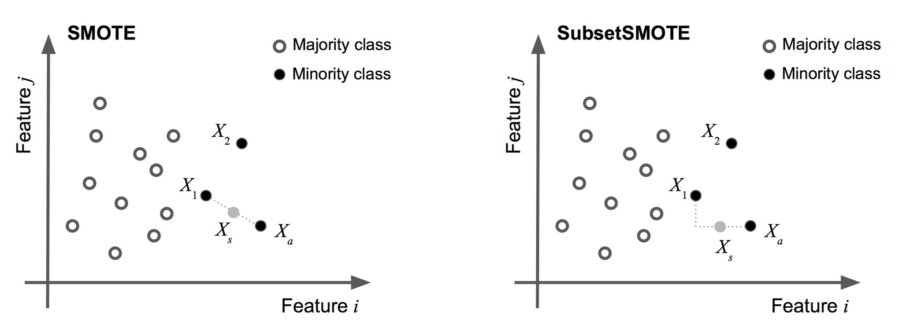

# BASS

A collection of classes to perform SubsetSMOTE oversampling and to create class- balanced Bagged classifiers using SMOTE or SubsetSMOTE. The two primary classes are:

- `SubsetSMOTE` : applying SMOTE to a subset of featues
- `SyntheticBaggingClassifier`: creating ensembles of classifiers from bags of data that are oversampled using eithe

## SubsetSMOTE

A collection of notebooks demonstrating SMOTE and SubsetSMOTE using the imbalanced-learn API. SubsetSMOTE applies SMOTE to a subset of features as opposed to all features. This results in creating new samples for the minority class that are random convex combinations of the subset of features. 


The figure below demnostrates the difference between SMOTE and SubsetSMOTE. In SMOTE, an anchor point $X_{a}$ from the minority class and its corresponding k-nearest neighbors are selected. A synthetic data point $X_{s}$ is then created by a random convex combination between the anchor point and a nearby point. This synthetic data creation process is done repeatedly until the minority class has the same number of examples as the majority. 

SubsetSMOTE is similar but applies the random convex combination in only a subset of the features. The subset of features to apply the combination can either be selected by the user (utilizing domain knowledge, for example) or selected at random. For random selection, the user can specify the percentage of features that should be used or use the heuristic of the square-root of the number of features as suggested by Breimann. If the number of features is very large (as in bioinformatics studies), we suggest using the log2 number of features as the heuristic.



## Bagging Synthetically Over-sampled Ensembles of Classifiers

We also provide an over-sampling bagging classifier `SyntheticBaggingClassifier` that creates class-balanced bags of data using either SMOTE or SubsetSMOTE. This is in contrast to `BaggingClassifier` in scikit-learn that do not balance the bags. That is, `SyntheticBaggingClassifier` balances each bag that is randomly sampled from the dataset creating synthetic samples with SMOTE/SubsetSMOTE. This is also in contrast to `BalancedBaggingClassifier` in the imbalanced-learn package that balances each bag by randomly *under-sampling*. 

## SubsetSMOTE minimal example

`X_unbalanced` and `y_unbalanced` are the input and target arrays to be used for training in classification algorithm (in scikit, eg). The minority class is heavily under-represented and we will use `SubsetSMOTE` to create new synthetic samples.  

```python
from bass import *

sampler = SubsetSMOTE(synth_features=.9)

X_balanced, y_balanced = sampler.fit_sample(X_unbalanced, y_unbalanced)

```

There are number of parameters for SubsetSMOTE and SMOTE. Some of the major ones are:

> - `synth_features`:  specify features to use for creating data. Use a list of integers to specify which columns of `X_unabalnced` should be used for data syntheiss. If float then then randomly draw `int(synth_features * n_features)` percentage of features for synthetic data creation. 
> - `fixed_features`: list of integers to select features to keep fixed. If None (defulat), then a random subset of features will be fixed according to synth_features. The union of fixed_features and synth_features equals the entire feature set of the data.         
> - `**kwargs`: additional parameters to pass for SMOTE, see the [imbalanced-learn documentation](http://contrib.scikit-learn.org/imbalanced-learn/stable/generated/imblearn.over_sampling.SMOTE.html). 


## SyntheticBaggingClassifier minimal example

Again `X_unbalanced` and `y_unbalanced` are the input and target arrays to be used for training in classification algorithm. The minority class is heavily under-represented and we will use `SubsetSMOTE` to create ensembles of decision trees based on balanced bags with new synthetic samples.  

```python
from bass import *
from sklearn.tree import DecisionTreeClassifier

sampler = SubsetSMOTE(synth_features=.9)
clf = DecisionTreeClassifier()
bagged_subset_smote = SyntheticBaggingClassifier(synth_sampling=sampler,
                                                 base_estimator=clf,
                                                 n_estimators = 10,
                                                 ratio=.2,
                                                 replacement=True,
                                                 random_state=0)


bagged_subset_smote.fit(X_unbalanced, y_unbalanced)

y_pred = bagged_subset_smote.predict(X_test)
```                                                 

## Installation

Download this `bass.py` to your working directory and import from there. Yay friction. 

Requirements are:

- scikit-learn 
- imbalanced-learn: http://contrib.scikit-learn.org/imbalanced-learn/stable/index.html

